# GAME-PROJECT---IN-YOUR-SERVICE
This is a DX ball version game, we've added some monster based features here. 


## Table of Contents

- [Prerequisites](#prerequisites)
- [Cloning the Repository](#cloning-the-repository)
- [Setting Up Locally](#setting-up-locally)
- [Running the Game](#running-the-game)


## Prerequisites

Before you begin, ensure you have the following installed on your machine:


- Visual Studio Code 2013


## Cloning the Repository

To get a copy of the project up and running on your local machine, follow these steps:

1. Open your terminal or command prompt.
2. Navigate to the directory where you want to clone the repository.
3. Run the following command to clone the repository:

    ```sh
    git clone https://github.com/Rifat-Shariar-Sakil-24/GAME-PROJECT-1-2.git
    ```

4. Navigate to the project directory:

    ```sh
    cd GAME-PROJECT-1-2
    ```

## Setting Up Locally

Once you have cloned the repository, you need to set it up locally in IntelliJ IDEA:

1. Open VS Code
2. Create C++ Empty Project
3. Import Igraphics Files 


## Running the Game

To run the game, follow these steps:

1. Open `game` and then `code.cpp`  run code file


## Some Game Play Shots


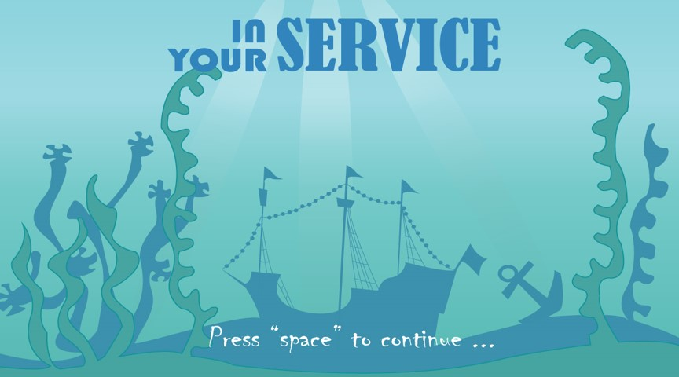

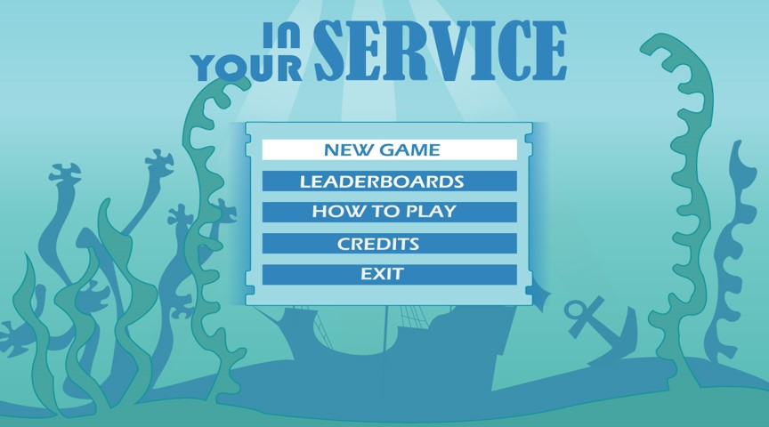

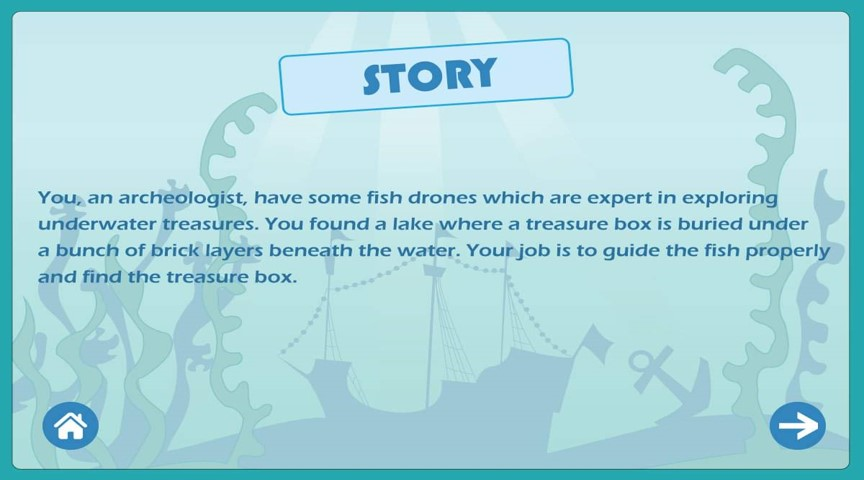

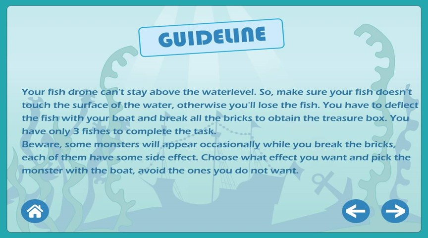

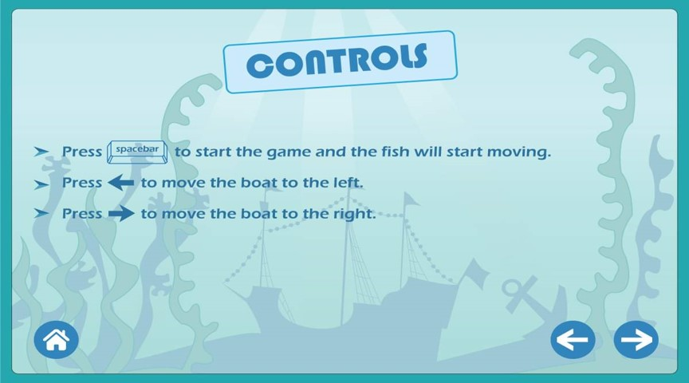

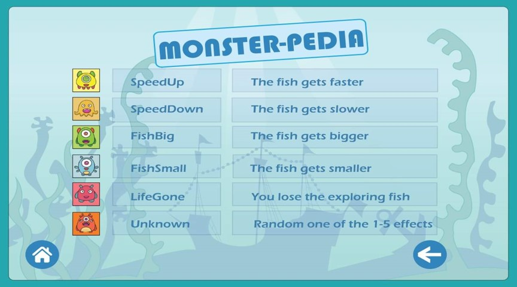

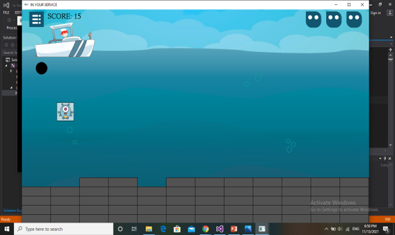

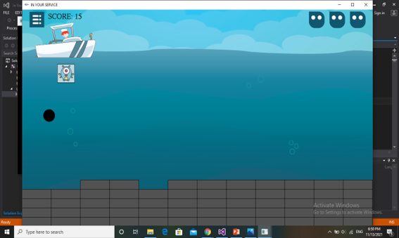

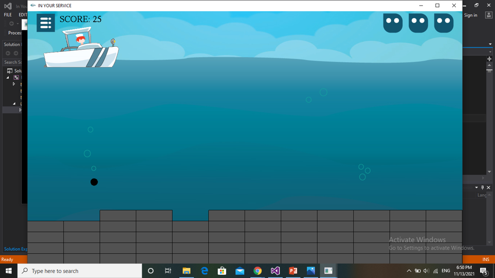


### Calculations to find Collision and ball direction

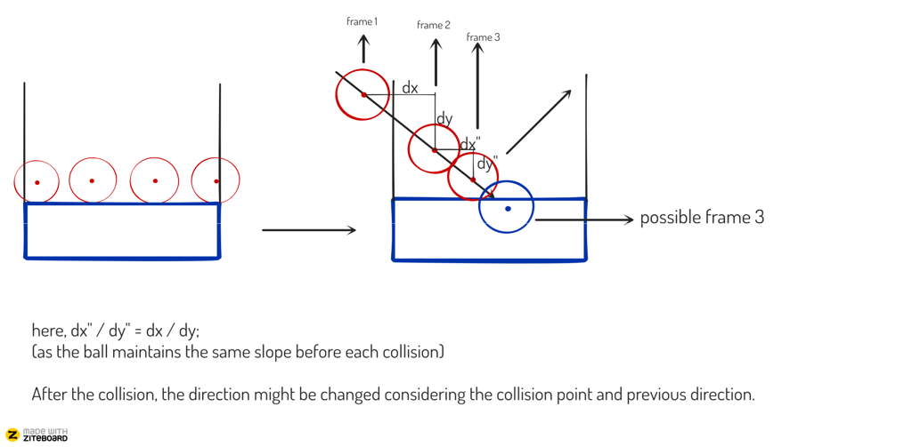

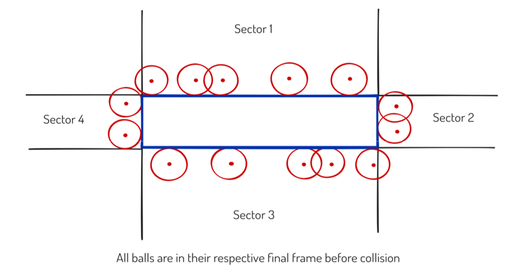


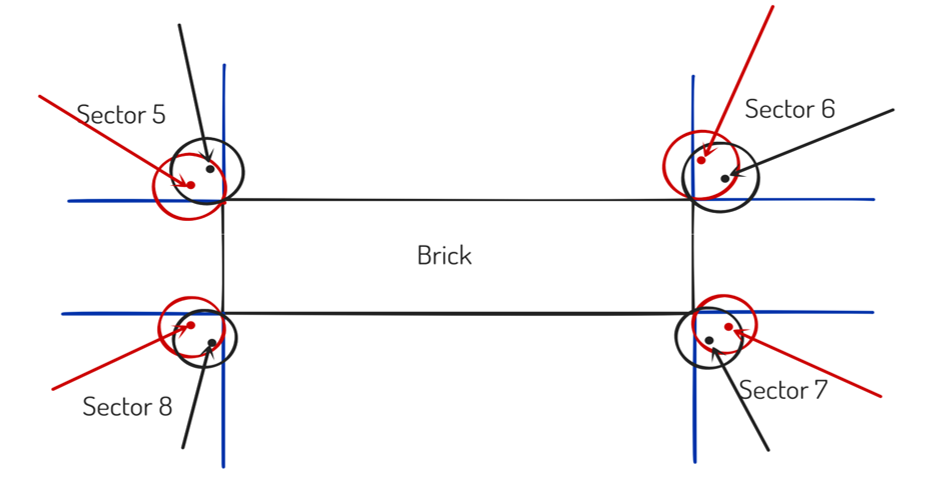

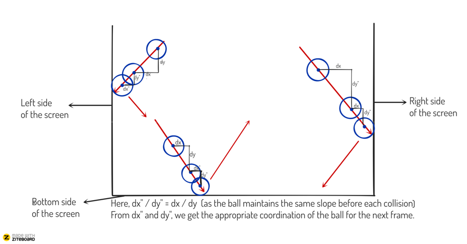

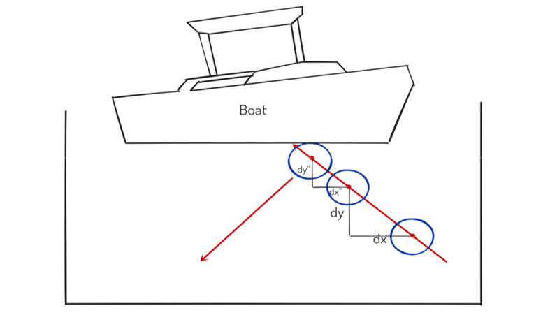


